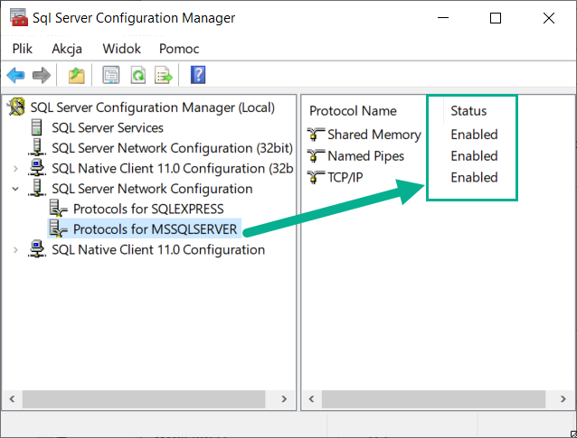

In this case, the content of Documentation.md is also included in the README.md file

# MD MS SQL MANAGEMENT
>Database management platform accepts logging via Windows Authentication or SQL Server Authentication. It allows performing simple operations like adding, updating, and deleting table rows of Wypozyczalnia_Gier_komputerowych database.

## System Requirements:
Basic requirements are 32 bit Windows 7, 2 processors, and 2.0 GB of RAM - SSD driver is also welcome. MD MS SQL MANAGEMENT is designed for running efficiently on both virtual and physical server machines.

# Installation and configuration process
## Installation
> Install the MD MSSQL Server Management. Follow steps from below:

#### Steps:
1. Open [Github.com/maciejdunal/ProjektSemestralny](https://github.com/maciejdunal/ProjektSemestralny)  Project.
2. Open *MD MSSQL Server Managment Installer/Release* folder then click on *MD MSSQL Server Managment Installer.msi*
3. Click on *Download* button (It is virus free file, check [VirusTotal Scan Log](https://www.virustotal.com/gui/file/410f1106003cb672704749ba0fb7b51485afe4d066fea8b88427eeffc90051de/detection))


4. Install an application using the downloaded file.


## Creating database
> At first, you must to create the *Wypozyczalnia_Gier_komputerowych* database. Follow steps from below:

#### Prerequisites:
- Installed Microsoft SQL Server
- Installed Microsoft SQL Server Management Studio

### Method 1
#### Steps:
1. Open *installation folder/SQL Scripts* folder
2. Right-click on **Create DB.sql** file


3. From context menu select Open with->SSMS
4. Provide correct Server type, Server name, then click *Connect* button
5. Click on *Execute* button or type *F5*

or

### Method 2
#### Steps:
1. Open *Microsoft SQL Server Management Studio*
2. From Top Menu select File->Connect to Object Explorer...
3. Provide correct Server type, Server name, then click *Connect* button
4. Click on *New Query* button or type *CTRL+N*


5. Copy and paste into querty following code:

```
CREATE DATABASE Wypozyczalnia_Gier_komputerowych
GO
USE [Wypozyczalnia_Gier_komputerowych]
CREATE TABLE Klienci(
ID_klienta INT PRIMARY KEY NOT NULL,
Nazwisko nChar(50) NOT NULL,
Imie nChar(50) NOT NULL,
Adres nChar(50) NOT NULL,
Kod_pocztowy nChar(10) NOT NULL,
Data_urodzenia date NOT NULL,
Numer_DO nChar(50) NOT NULL);
GO
CREATE TABLE Gry(
ID_gry INT PRIMARY KEY NOT NULL,
Nazwa nChar(50) NOT NULL,
Kategoria nChar(50) NOT NULL,
Kategoria_wiekowa nChar(50) NOT NULL,
Data_wydania nChar(10) NOT NULL,
Cena_dzien INT NOT NULL);
GO
CREATE TABLE Pracownicy(
ID_pracownika INT PRIMARY KEY NOT NULL,
Imie nChar(50) NOT NULL,
Nazwisko nChar(50) NOT NULL,
Data_urodzenia date NOT NULL,
Adres nChar(50) NOT NULL,
Stanowisko nChar(50) NOT NULL);
GO
CREATE TABLE Wypozyczenia(
ID_wypozyczenia INT PRIMARY KEY NOT NULL,
ID_Gry INT NOT NULL,
ID_pracownika INT NOT NULL,
ID_klienta INT NOT NULL,
Data_wypozyczenia date NOT NULL,
CONSTRAINT RelacjaGry FOREIGN KEY (ID_Gry)
REFERENCES Gry(ID_Gry)
ON DELETE CASCADE,
CONSTRAINT RelacjaPracownicy FOREIGN KEY (ID_pracownika)
REFERENCES Pracownicy(ID_pracownika)
ON DELETE NO ACTION,
CONSTRAINT RelacjaDoKlient FOREIGN KEY (ID_klienta)
REFERENCES Klienci(ID_klienta)
ON DELETE CASCADE,
);
GO
CREATE TABLE Zwroty(
ID_wypozyczenia INT PRIMARY KEY NOT NULL,
ID_pracownika INT NOT NULL,
data_zwrotu date NOT NULL,
doplaty INT NOT NULL,
CONSTRAINT RelacjaWypozyczenia FOREIGN KEY (ID_wypozyczenia)
REFERENCES Wypozyczenia(ID_wypozyczenia)
ON DELETE no action,
CONSTRAINT Relacjapracownicy2 FOREIGN KEY (ID_pracownika)
REFERENCES Pracownicy(ID_pracownika)
ON DELETE NO ACTION,
);
GO

INSERT INTO Pracownicy(ID_pracownika,imie,nazwisko,data_urodzenia,adres,stanowisko) VALUES('5','Maciej','Kowalski','1997-04-16','Miechów 8','Właściciel'),
('1','Jan','Pierwszy','1977-12-13','Miechów 3','Kierownik'),
('2','Jan','Drugi','1957-04-29','Kraków 4','Kierownik'),
('3', 'Jan', 'Trzeci', '1972-10-22', 'Miechów 5', 'Kasjer'),
('4', 'Jan', 'Czwarty', '1978-08-21', 'Kraków 6', 'Kasjer');
INSERT INTO Klienci(ID_klienta,nazwisko,imie,adres,kod_pocztowy,data_urodzenia,numer_DO) VALUES ('1','Nowak','Andrzej','Poznań 1','42-500','1990-01-01','AKB 987123'),
('2','Kowalski','Marek','Wieliczka','33-120','1978-01-11','TRQ 432543'),
('3','Słowak','Krzysztof','Katowice','30-003','1970-03-12','OOP 878456'),
('4','Nowak','Eugeniusz','Gdynia','27-412','1990-02-27','ARK 413948'),
('5','Zawadzki','Alojzy','Sopot','12-321','1993-07-19','POA 172931');
INSERT INTO Gry(ID_gry,Nazwa,Kategoria,Kategoria_wiekowa,Data_wydania,cena_dzien) VALUES ('1','World Of WarCraft','MMORPG','15','2004','15'),
('2','Dota 2','MOBA','12','2012','20'),
('3','Diablo III','Hack-and-Slash','15','2008','31'),
('4','Heroes','Kampania','16','2000','15'),
('5','Fifa','Sport','12','2020','35');
INSERT INTO Wypozyczenia(ID_wypozyczenia,ID_Gry,ID_pracownika,ID_klienta,data_wypozyczenia) VALUES('1','3','3','1','2020-12-25'),
('2','1','4','2','2020-12-23'),
('3','2','2','3','2020-12-22'),
('4','5','3','4','2020-12-09'),
('5','4','4','5','2020-12-05');
INSERT INTO Zwroty(ID_wypozyczenia,ID_pracownika,data_zwrotu,doplaty) VALUES ('1','3','2020-12-30','2322'),
('2','4','2020-12-31','995'),
('3','1','2020-12-30','553'),
('4','3','2020-12-29','453'),
('5','5','2020-12-28','767');
GO
```
6. Click on *Execute* button or type *F5*

> Note: <br> From now you able to manage *Wypozyczalnia_Gier_komputerowych* database in *MD MSSQL Server Management* application using *Windows Authentication*.

## Connecting to *MD MSSQL Server Management* using **Windows Authentication**

#### Steps:
1. Open *MD MSSQL Server Management* application
2. Click on dropdown at the middle of the *Connect to database...* window
3. Select **Windows Authentication**
4. Click on *Connect* button


## Creating Login User and User in SQL Server

### Method 1
#### Steps:
1. Open *installation folder/SQL Scripts* folder
2. Right-click on **Create User.sql** file


3. From context menu select Open with->SSMS
4. Provide correct Server type, Server name, then click *Connect* button
5. Click on *Execute* button or type *F5*

or

### Method 2
#### Steps:
1. Open *Microsoft SQL Server Management Studio*
2. From Top Menu select File->Connect to Object Explorer...
3. Provide correct Server type, Server name, then click *Connect* button
4. Click on *New Query* button or type *CTRL+N*


5. Copy and paste into querty following code:

```
CREATE LOGIN [user] WITH PASSWORD = '1234'
USE [Wypozyczalnia_Gier_komputerowych]
CREATE USER [user] FOR LOGIN [user] WITH DEFAULT_SCHEMA=[dbo]
GO
ALTER ROLE [db_owner] ADD MEMBER [user]
```
6. Click on *Execute* button or type *F5*

> Note: <br> Script creates user with *username:* user and *password:* 1234.    
>> To create your own user, just change *user* to your own login and "1234" to your own password anywhere in the code or script code.
>* There is a third method of adding a user to server using UI that is not covered in this document

## Enabling *SQL Server and Windows Authentication mode*
> The server authentication is set to Windows authentication mode after installation by default. To take full advantage of the program's capabilities, this should be changed to *SQL Server and Windows Authentication mode*. Follow steps from below:

### Method 1
#### Steps:
1. Open *installation folder/SQL Scripts* folder
2. Right-click on **Enable LoginMode.sql** file


3. From context menu select Open with->SSMS
4. Provide correct Server type, Server name, then click *Connect* button
5. Click on *Execute* button or type *F5*

or
### Method 2
#### Steps:
1. Open *Microsoft SQL Server Management Studio*
2. From Top Menu select File->Connect to Object Explorer...
3. Provide correct Server type, Server name, then click *Connect* button
4. Click on *New Query* button or type *CTRL+N*


5. Copy and paste into querty following code:

```
USE [master]
GO
EXEC xp_instance_regwrite N'HKEY_LOCAL_MACHINE', 
     N'Software/Microsoft/MSSQLServer/MSSQLServer',
     N'LoginMode', REG_DWORD, 2
GO
```
6. Click on *Execute* button or type *F5*

> Note: <br> From now you able to manage *Wypozyczalnia_Gier_komputerowych* database in *MD MSSQL Server Management application* using *SQL Server Authentication*.
> * There is a third method of enabling the *SQL Server and Windows Authentication mode* using UI that is not covered in this document.

## Connecting to *MD MSSQL Server Management* using **SQL Server Authentication**

### Prerequisites:
- Enabled *SQL Server and Windows Authentication mode*
- Created Login User and User in SQL Server

#### Steps:
1. Open *MD MSSQL Server Management* application
2. Click on dropdown at the middle of the *Connect to database...* window
3. Select **SQL Server Authentication**
4. Enter correct user name and password (in case of example from above user/1234)
5. Click on *Connect* button


## Enabling TCP/IP and Names Pipes Protocols
> In case of any probles with connection to the SQL Server please enable TCP/IP and Names Pipes Protocols. Follow steps from below:

#### Steps:
1. Open SQL Server Configuration Manager
2. Expand SQL Server Network Configuration
3. Select proper instance (in case of example *Protocols for MSSQLSERVER*)
4. Right-Click-> Enabled on Named Pipes
5. Right-Click-> Enabled on TCP/IP



6. Open Run->services.msc
7. Restart SQL Server service


# Application Management
> After successfully logging in, we can start using the application

## Select table


> This window appears after logging in. We can choose which table from the database we want to preview.
 <br> To open table management follow steps from below: 

1. Click on the dropdown
2. Select any desired table to manage
3. Click *Open* button

> Note: <br> After opening any table window, you can back to select table window by using the *Back* button.


## Table window
> Each table window has a Datagrid displaying the contents of the table, 4 functions buttons, and text boxes appropriate for each table <br> 

Buttons:
- Add - Allows to add rows
- Update - Allows to update rows
- Delete - Allows to delete rows
- Reset - Resets the content of text boxes
- Back - Back to *Select Table* window

## Add operation
>It is possible to add new records to table following steps from below:
### Steps:
1. Enter the appropriate value for a given column for each textbox (e.g ID wypozyczenia: 6 ; ID Gry: 3 ; ID Pracownika: 4 ; ID klienta: 3 ; Data wypozyczenia 2/24/2021)
2. Click *Add* button


## Update operation
>It is possible to update any existing row from table following steps from below:
### Steps:
1. Click on desired row to update from datagrid (e.g 6th)


2. Enter the appropriate value for a given column for each textbox (e.g ID Gry: 1 ; ID Pracownika: 2 ; ID klienta: 2 ; Data wypozyczenia 2/24/2021)


3. Click *Update* button

> Note: <br> No possibility to upgrade a primary key value!
## Delete operation
>It is possible to delete any row from table following steps from below:
### Steps:
1. Click on desired row to update from datagrid (e.g 4th)
2. Click *Delete* button


